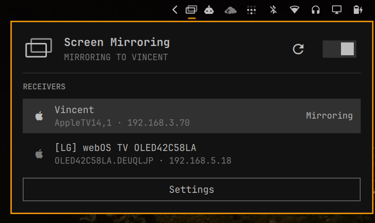

# Screen Mirroring

An Omarchy Quattro bar widget for mirroring a Linux desktop to compatible receivers with [doubletake](https://github.com/omarroth/doubletake).



## Features

- Discovers compatible receivers when the panel opens or **Reload** is selected.
- Mirrors a Wayland screen or window selected through the desktop portal.
- Shows connecting, credential, streaming, failure, and firewall-cleanup states.
- Reconnects to the last receiver from the hero icon or on/off switch.
- Supports one-time pairing PINs and configured receiver passwords.
- Remembers additional doubletake arguments, such as `-hwaccel vaapi`.
- Opens tagged, receiver-specific UFW rules for TCP and UDP ports `60000:60010`.
- Can retain rules per receiver to avoid repeated Polkit authentication.
- Cleans up temporary rules after disconnects, failures, and unexpected exits.
- Supports mouse and keyboard operation.

## Requirements

- Omarchy Quattro with the Omarchy shell.
- A receiver supported by doubletake.
- A working PipeWire screen-cast portal.
- UFW and a desktop Polkit authentication agent.

The widget checks all runtime dependencies before enabling receiver controls.

### Official Packages

```text
gstreamer
gst-plugins-base
gst-plugins-good
gst-plugins-bad
gst-plugins-ugly
gst-libav
gst-plugin-va
libva-utils
libpulse
pipewire
xdg-desktop-portal
xdg-desktop-portal-hyprland
xdg-terminal-exec
ufw
polkit
python
```

### AUR Package

```text
doubletake
```

The dependency check also verifies `doubletake`, `doubletake-ctl`, `pactl`, `pipewire`, `pkexec`, `ufw`, `vainfo`, `xdg-terminal-exec`, and the required `pipewiresrc` and `h264parse` GStreamer elements. VA-API availability is reported separately by checking `vah264enc`.

## Install

```sh
omarchy plugin add https://github.com/spaceXrace/omarchy-screen-mirroring --enable --yes
```

Open the widget and select **Install dependencies** if anything is missing. The installer uses Omarchy's package commands:

```sh
omarchy pkg add gstreamer gst-plugins-base gst-plugins-good gst-plugins-bad \
  gst-plugins-ugly gst-libav gst-plugin-va libva-utils libpulse pipewire \
  xdg-desktop-portal xdg-desktop-portal-hyprland xdg-terminal-exec \
  ufw polkit python
omarchy pkg aur add doubletake
```

## Usage

1. Open the Screen Mirroring widget. It scans for receivers for approximately five seconds.
2. Select a receiver.
3. Approve the receiver-specific firewall rules through the Polkit dialog when requested.
4. Select a screen or window in the desktop portal.
5. Enter a PIN or configured receiver password in the panel if doubletake requests one.
6. Use the hero icon or switch to stop mirroring.

The hero displays the receiver name while connecting and streaming. When idle, its icon and switch reconnect to the last receiver.

## Keyboard Controls

- Arrow keys or `h`, `j`, `k`, `l`: move between header actions, receiver rows, and Settings.
- `Enter` or `Space`: activate the focused action or receiver.
- `r`: reload receivers.
- `w`: start or stop mirroring.
- `Escape`: close the panel.

Credential and argument text fields receive normal keyboard input while focused. Pressing Enter submits a PIN or password.

## Credentials

Doubletake supports both credential modes exposed by the widget:

- **Pairing PIN:** a temporary code displayed by the receiver.
- **Configured password:** the static password configured in the receiver's screen-mirroring settings.

Credentials are passed from the widget to its helper over standard input and then to the running doubletake process through a private FIFO. They are never placed in command-line arguments. Doubletake stores successful pairing credentials in its own credential store, normally `~/.config/doubletake/credentials.json`.

## Firewall

Doubletake reserves local ports `60000-60010`. The widget validates the receiver IP and asks Polkit to run the system-owned `/usr/bin/ufw` executable with fixed TCP and UDP rules restricted to that address. Rules are tagged with `spacexrace.screen-mirroring-<IP>` so cleanup removes only rules owned by this plugin.

By default, rules are removed after disconnect, failed setup, or an unexpected stream exit. If Polkit authentication is dismissed or cleanup fails, the panel displays **Remove leftover firewall rules**.

Enable **Keep receiver ports open** in Settings to retain the receiver-specific rules after the first approval. Turning it off removes all retained plugin-owned rules.

## Settings

- **Doubletake arguments:** optional performance settings saved under the plugin's Omarchy configuration. Allowed options are `-bitrate`, `-fps`, `-hwaccel`, `-target-latency-ms`, `-no-audio`, `-no-cursor`, and `-pair`. Connection, credential, encryption, capture-source, socket, and port options are rejected because the plugin manages those values.
- **Keep receiver ports open:** retains receiver-specific UFW rules to avoid future firewall password prompts.
- **VA-API status:** reports whether the GStreamer `vah264enc` element is available.

Plugin settings are stored in `~/.config/omarchy/screen-mirroring/`. Runtime files use the owner-only `$XDG_RUNTIME_DIR/omarchy-screen-mirroring/` directory, falling back to `/run/user/$UID/omarchy-screen-mirroring/` when the environment variable is unavailable. The plugin refuses shared or incorrectly owned runtime directories. Doubletake logs are written to `~/.cache/omarchy-screen-mirroring/doubletake.log`.

## Troubleshooting

### Receiver Compatibility

Receiver support is provided by doubletake. Some third-party implementations require upstream protocol fixes. For example, LG webOS PTP support is currently tracked in [doubletake PR #31](https://github.com/omarroth/doubletake/pull/31).

### Logs

```sh
tail -f ~/.cache/omarchy-screen-mirroring/doubletake.log
journalctl --user -u xdg-desktop-portal-hyprland.service -f
```

## Remove

Stop any active stream before removing the plugin. **Before uninstalling, open Settings and disable “Keep receiver ports open”** so the plugin removes every retained firewall rule. Removing the plugin first prevents it from performing that cleanup.

```sh
omarchy plugin remove spacexrace.screen-mirroring --yes
```

## Development

```sh
omarchy plugin validate .
qmllint -I "$OMARCHY_PATH/shell" BarWidget.qml Panel.qml
bash -n bin/omarchy-screen-mirroring
```

## License

This plugin is MIT licensed. Doubletake is a separate LGPL-3.0-or-later dependency. AirPlay and Apple are trademarks of Apple Inc.; this project is not affiliated with or endorsed by Apple.
